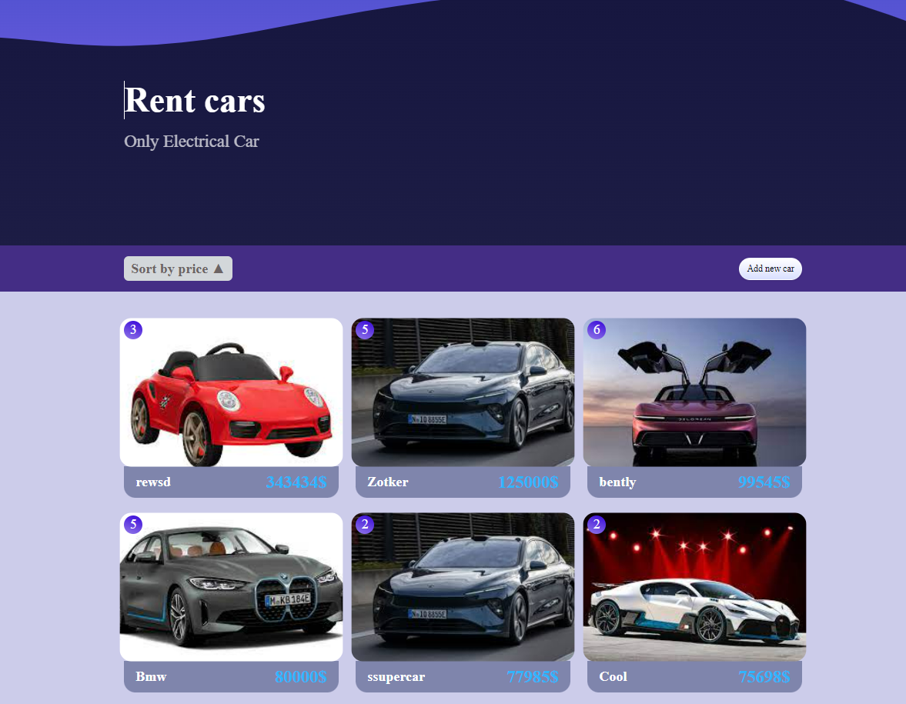

# React + Vite
The repository contains two parts code : server and client.
Server built with Express.js, Mongodb.
Client built with React+Vite.
## Readme.me
The repository contains the source code for an rent car shop, consisting of next pages: the homepage with all cars, cingle car page withi discription, create new car page and order page.


## Features
The car shop web application includes the following features:

Sorting cars: Users can sort cars by price.
Adding to cart: Users can add car to their shopping cart.
Add new car : Users can add new car for rent.

## Technologies Used
The car shop web application is built using the following technologies:

ReactJS: A JavaScript library for building user interfaces.
<p>React Router: A routing library for React applications.</p>
<p>Redux: A predictable state container for JavaScript applications.</p>
<p>Redux Thunk: A middleware for Redux that allows handling asynchronous actions.</p>
<p>Mongodb:  open-source document database that provides high scalability, flexibility, and performance.</p>
<p>Express.js:  web application framework for Node.js. It provides a simple and flexible way to build web applications and APIs by providing a set of functions and middleware that simplify common web development tasks.</p>
<p>Axios: A promise-based HTTP client for making API requests.</p>
<p>react-hook-form: add form library.</p>

## Installation
To run the car shop web application locally, follow these steps:

Clone the GitHub repository:


git clone https://github.com/evgenijkadyrov/carShop.git
```

Navigate to the project directory:


cd carShop
```

Install the dependencies:

```
yarn
```

Navigate to the project client-directory:
```
cd carShop/client
```
Install the dependencies:
```
yarn
```
Start the development app:

```
yarn dev
```


## License
This project is licensed under the MIT License. See the LICENSE file for more information.


